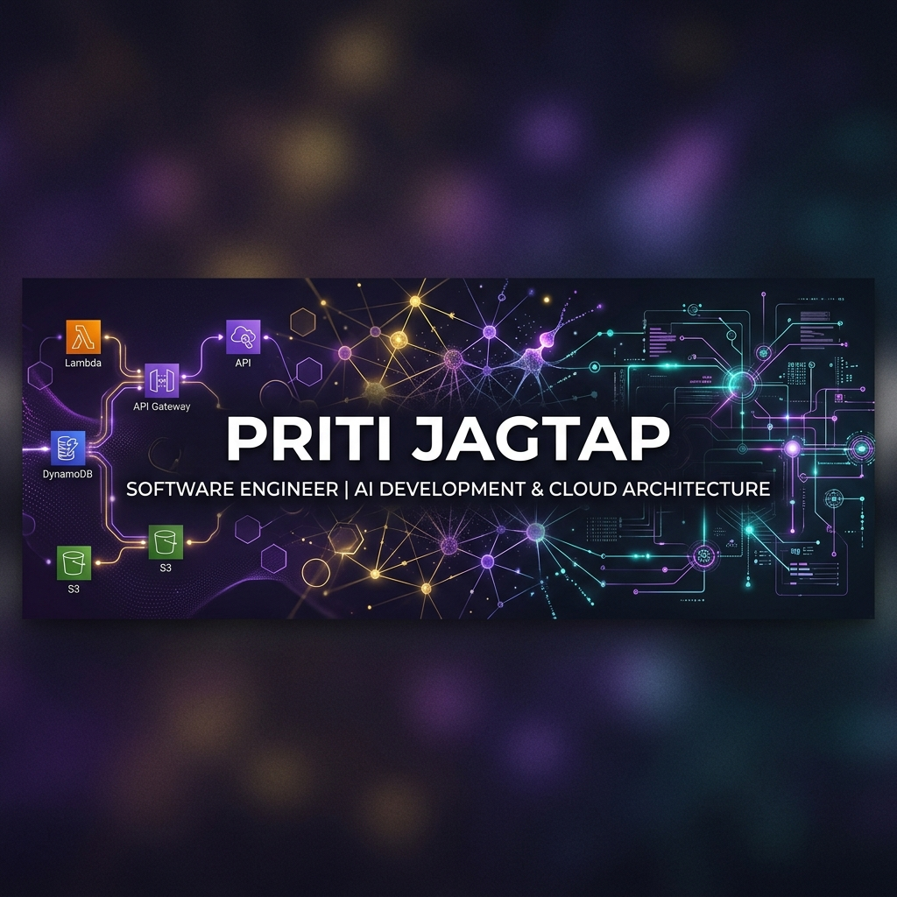

  

 

  <h1>Hi there, I'm Priti Jagtap 👋</h1>
  
<strong>Lead AWS Cloud & AI Engineer @ Delta Air Lines | Specializing in AI Development & Cloud Architecture</strong>

  
  

    
    
  

---

### 💫 About Me

I am a cloud engineer focused on bridging the gap between legacy enterprise infrastructure and modern artificial intelligence. I specialize in designing highly available serverless backends and integrating large language models to automate complex workflows at airline scale.

* 🎓 **Education:** M.S. in Computer Science | **University of Central Florida**
* 🏢 **Current Role:** Leading AWS Cloud & AI Engineering for customer communication platform modernization at **Delta Air Lines**.
* 🧠 **AI Focus:** Orchestrating data extraction pipelines and Retrieval-Augmented Generation (RAG) architectures with Amazon Bedrock.
* 🤝 **Community:** Leading digital strategy and Webflow management for the **[Center for Movement Challenges](https://www.centerformovementchallenges.org/)** in Sandy Springs.

---

### 🛠️ Tech Stack & Tools

  <table>
    <tr>
      <td align="center" width="33%" valign="top">
        <strong>Cloud & Serverless</strong>  
         
         
         
         
        
      </td>
      <td align="center" width="33%" valign="top">
        <strong>AI & Backend</strong>  
         
         
         
         
        
      </td>
      <td align="center" width="33%" valign="top">
        <strong>DevOps & Web</strong>  
         
         
         
         
        
      </td>
    </tr>
  </table>

---

### 📂 Featured Architectures & Projects

<table width="100%">
  <tr>
    <td width="33%" valign="top">
      <h4>🚀 Kairos</h4>
      
<strong>AI-Driven Matching Platform</strong>

      
Architected an intelligent alignment platform utilizing advanced LLM orchestration. Designed the matching logic, latent semantic indexing models, and custom visual brand identity to connect candidate profiles with programmatic job market data.

    </td>
    <td width="33%" valign="top">
      <h4>✈️ Delta Comm Modernization</h4>
      
<strong>Enterprise Platform Migration</strong>

      
Led AWS Serverless migration (CDK, Lambda, DynamoDB) of Delta's customer notification system. Engineered Bedrock LLM pipelines parsing complex customer interaction logs into structured JSON, and built a Bedrock RAG system for internal documentation.

    </td>
    <td width="33%" valign="top">
      <h4>🎮 <a href="https://chorequest.pro/" target="_blank">ChoreQuest.pro</a></h4>
      
<strong>Gamified Family Manager</strong>

      
Conceptualized, built, and deployed a live, full-stack gamified family management application. Handled end-to-end development from database design to production hosting, turning daily chores into XP-gaining quests.

    </td>
  </tr>
</table>

---

  
<em>"Building serverless pipelines and orchestrating intelligent agents to shape the future of enterprise operations."</em>

  © 2026 Priti Jagtap

